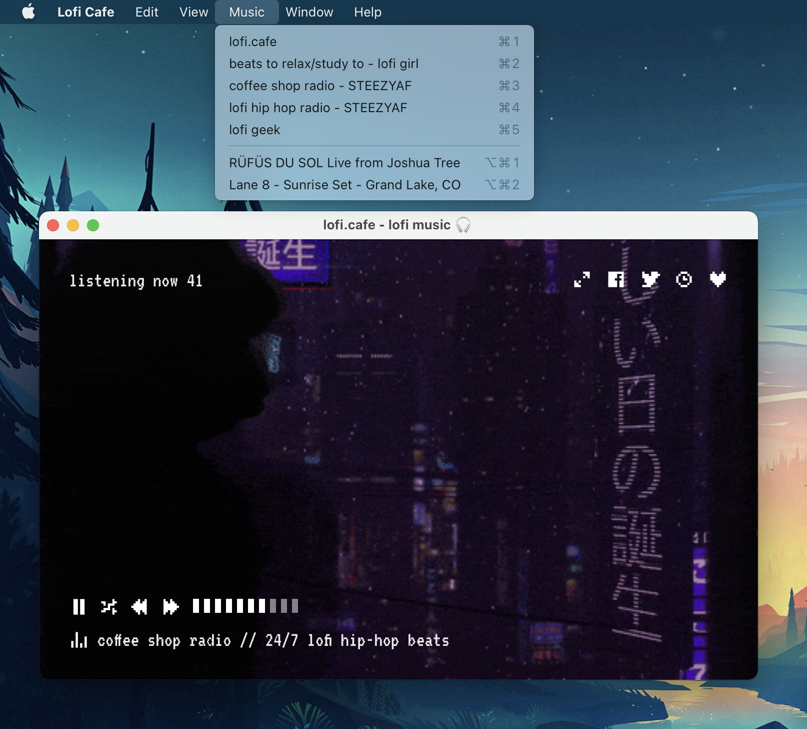
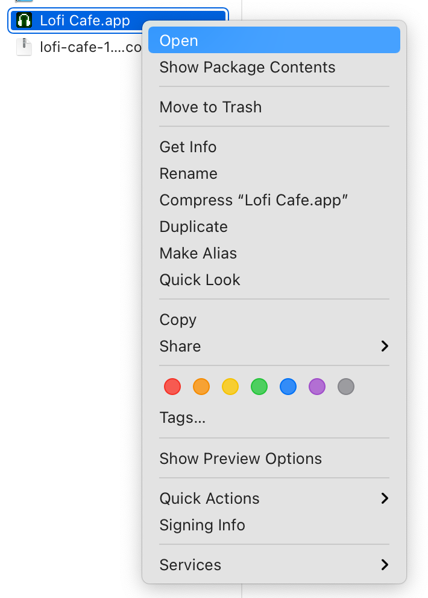
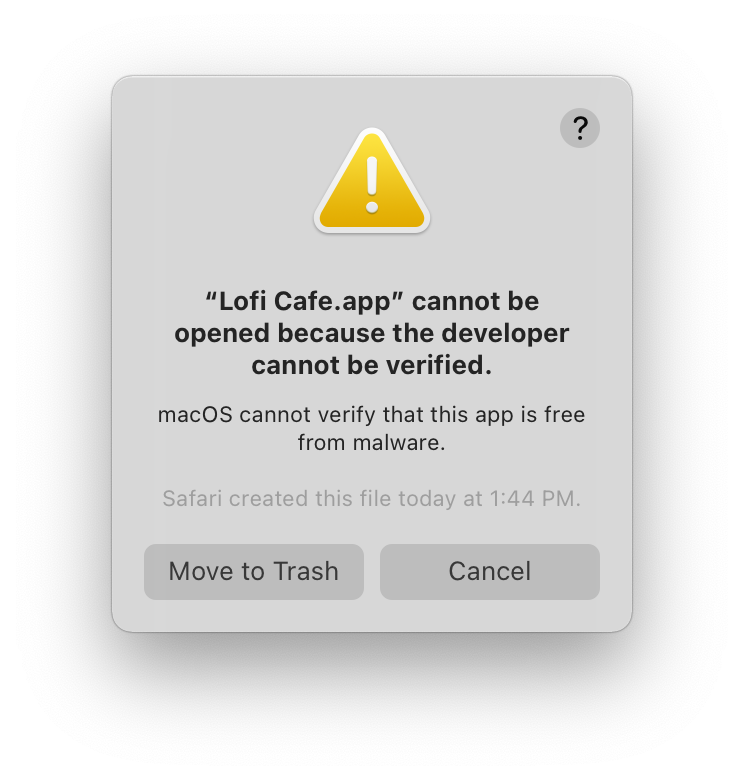

# Lofi Cafe (& Friends) Electron App

> [!WARNING]
> [The tool this app relied on, Nativefier, is no longer maintained.](https://github.com/nativefier/nativefier/issues/1577)
>
> This app is therefore no longer maintained and should not be used.

## macOS

### Installing from a downloaded package

1. Download the latest version for your machine from [the releases page](https://github.com/cdzombak/lofiapp/releases/latest). Unless you have a new Mac with an Apple Silicon processor, you need the `macos-x64` version.
2. Open the downloaded `.zip` file. This will extract the file `Lofi Cafe.app`.
3. Drag `Lofi Cafe.app` to your `Applications` folder.
4. To open the app the first time, you need to right-click `Lofi Cafe.app` in Finder and select Open in the context menu:

Failing to follow that last step will cause macOS to present a warning like this:

This warning, and the workaround, are because ~~I'm not currently paying Apple $99/year for a developer account~~ I'm paying Apple for a developer account but haven't yet figured out how to notarize this Electron app.

### Installing with developer tools (`make`, `npm`)

1. Install `npm` on your system.
2. Clone this repository.
3. Run `make install-mac` in this directory to build & install the app in `/Applications`.

## Protip

On lofi.cafe, hit the `L` key to enable "low power mode". The site seems to remember this preference for you.

